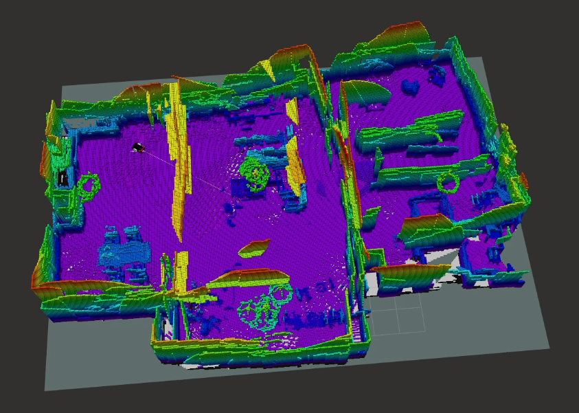
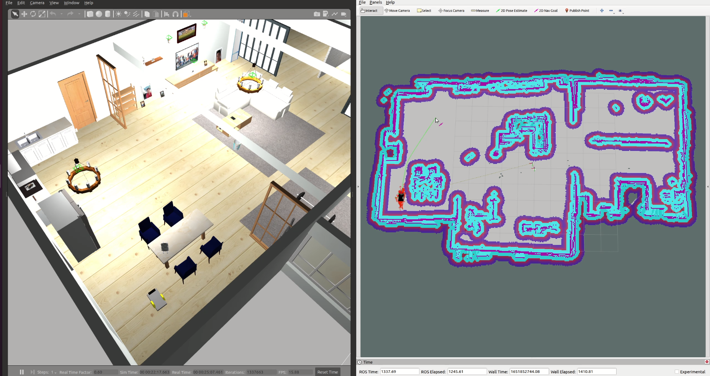

Autonomous SLAM using a differential drive robot. 
This work is a project for *Introduction to Robotics* class.

# Overview
There are two videos showing the whole setup in action: [Building a map of the environment | ROS Gmapping | Octomap](https://youtu.be/mLMfofIn_PM) and [Autonomous Robot navigation using the ROS Navigation](https://youtu.be/94Ar3pGP3KM). 

# Prerequisites

This project was developed for ROS Noetic (Ubuntu 20.04). The following
packages are required:
1. [pointcloud_to_laserscan package](http://wiki.ros.org/pointcloud_to_laserscan), is used to convert a 3D Point Cloud into a 2D laser scan, this can be installed using: `sudo apt install ros-noetic-pointcloud-to-laserscan ros-noetic-rosbridge-server`
2. To control the robot, you might need to install the [teleop_twist_keyboard package](http://wiki.ros.org/teleop_twist_keyboard) and then run teleop_twist_keyboard teleop_twist_keyboard.py.
3. [OctoMap](http://wiki.ros.org/octomap) is used to generate the 3D occupancy
   grid. `octomap_server` is used to interface OctoMap with ROS, both can be
   installed via `apt` as `ros-noetic-octomap` and `ros-noetic-octomap-ros`.

4. You'll need to install the [OctoMap RViz
   plugin](https://github.com/OctoMap/octomap_rviz_plugins) via `apt` as
   `ros-noetic-octomap-rviz-plugins`. Without it, occupancy grid
   visualisations in RViz will not work.
5. You will also need to install the controller_manager package: `sudo apt-get install ros-noetic-controller-manager`
6. The probabilistic localization system *amcl* is also needed, you can install it with: `sudo apt install ros-noetic-amcl`

#### Note: you might need to install more packages depending on what you have previously installed, if you have any problem just google it, and install the package needed.

# Usage
1. Make sure you have the prerequisites installed.
2. Clone this repo into your [catkin workspace](http://wiki.ros.org/catkin/Tutorials/create_a_workspace), e.g.
   into `~/catkin_ws/src/navros_pkg/`.
3. Clone [aws-robomaker-small-house-world](https://github.com/aws-robotics/aws-robomaker-small-house-world) repo into your catkin workspace, e.g.
   into `~/catkin_ws/src/small-house-world/`.
   * Add the following to your launch file:
```xml
<launch>
  <!-- Launch World -->
  <include file="$(find aws_robomaker_small_house_world)/launch/small_house.launch"/>
  ...
</launch>
```


4. Source your ROS in the Bash instance: `source
   /opt/ros/noetic/setup.bash` and `source ~/catkin_ws/devel/setup.bash`.
5. Run `catkin_make` in `~/catkin_ws/` and `source
   ~/catkin_ws/devel/setup.bash` again.   
   
## Start Gazebo Simulation
6. Start the simulation using: `roslaunch aws_robomaker_small_house_world view_small_house.launch`.
7. Spawn the robot in the map using: `roslaunch navros_pkg urdf_gazebo_view.launch`.
Keep this terminal running for all the next steps.

## Mapping
3D occupancy grid map            |  2D occupancy grid map
:-------------------------:|:-------------------------:
  |  

8. Run the gmapping SLAM command:`roslaunch navros_pkg gmapping.launch`
9. Navigate to rviz folder using:`cd catkin_ws/src/navros_pkg/rviz` then run it using: `rviz -d map.rviz`
10. For OCTOMAP use:`roslaunch navros_pkg octomap.launch`
Then navigate to rviz folder using:`cd catkin_ws/src/navros_pkg/rviz` then run it using: `rviz -d octomap.rviz`
11. To control the drone manually, you use: `rosrun teleop_twist_keyboard teleop_twist_keyboard.py` but it requires [teleop_twist_keyboard](http://wiki.ros.org/teleop_twist_keyboard) package to be installed.
12. Once mapping is complete, Save the map: `rosrun map_server map_saver ~/catkin_ws/src/navros_pkg/maps/name_of_map`
if this command is not working for some reason, then run this `rosrun map_server map_saver` then copy the map generated in *src* directory to *~/catkin_ws/src/navros_pkg/maps/* directory.
Finally close everything, and relaunch gazebo only with the robot (repeat steps 6 and 7).

## Autonomous Navigation


13. To start the navigation using the previously generated map, run each of the following commands in a new terminal:
* A) `roslaunch navros_pkg amcl.launch map:='name_of_map'` if you picked a name for your map make sure to change *name_of_map* otherwise it should be *map* (check the name in the maps folder).
* B) `roslaunch navros_pkg move_base.launch`
* C) `cd catkin_ws/src/navros_pkg/rviz` then `rviz -d navigate.rviz`

14. Test navigation using rviz:
* Set initial pose (Click "2D pose estimate" and pinpoint the approximate location of robot on map).*
* Red arrows indicate the probable location.
* Set goal for the robot in RVIZ (Click "2D Nav goal" and pinpoint the desired goal on the map).
* Green line indicates the path planned.

15. Thanks and PROFIT


